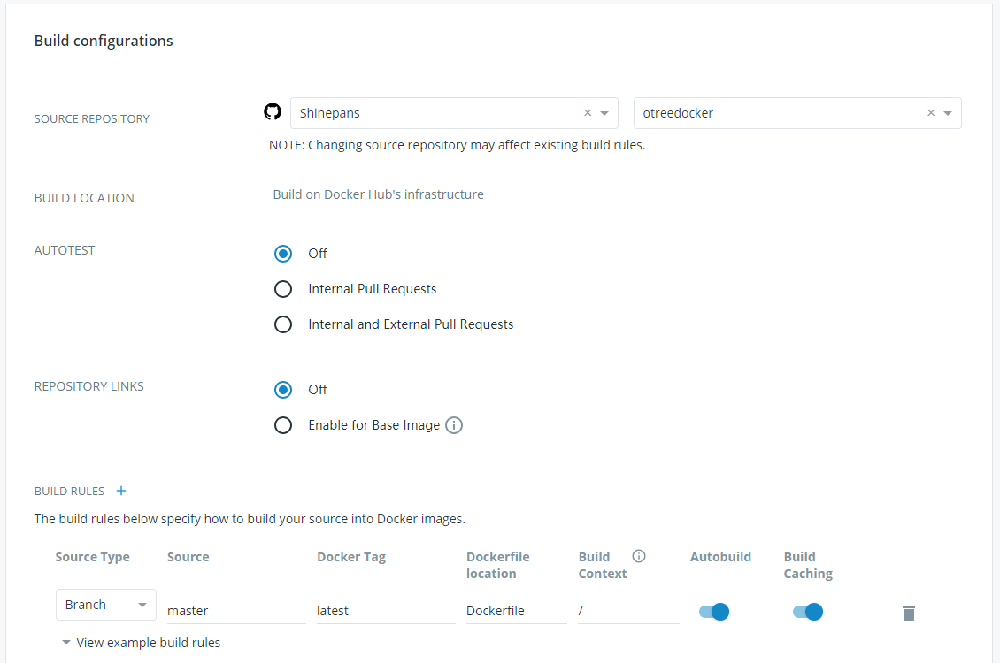
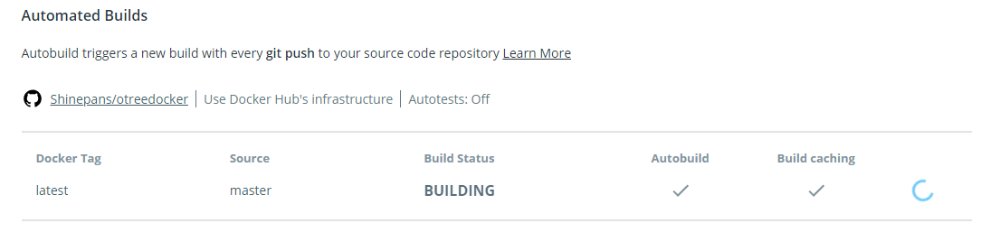

# otreeDocker


config of otree docker

使用Docker 配置 otree 就像运行一个已经配置 Postgres，Redis，oTree，Python的虚拟机

- 仓库： https://cloud.docker.com/repository/docker/shinepans/otreedocker

## docker hub account

- 创建docker hub 账户
- 账户设置中关联 github 账户

## github上创建 otree docker文件仓库

- 取名为 otreedocker
- 包含以下文件并push到 master

```
.dockerignore
Dockerfile
entrypoint
pg_ping.py
```

## 在docker hub上创建仓库

- 取名为 otreedocker
- 在Builds中设置github的仓库源



- 然后自动 building



## 在 Server上创建 Docker

- 创建otree-docker 文件夹
- 进入otree-docker 文件夹
- 将以下文件放进 otree-docker文件夹

```
docker-compose.yaml
.env
```

- 打开 docker-compose.yaml，修改image配置为：

```
image: shinepans/otreedocker:latest
// image: Docker账户名/Repo名:latest
```

- 打开 .env, 根据需要自定义

```
OTREE_PORT： otree 运行的端口
OTREE_ADMIN_PASSWORD： otree 管理员密码
OTREE_PRODUCTION： 生产环境
OTREE_AUTH_LEVEL： 运行模式
```

#### 配置 docker compose：  Linux下

- 安装 docker engine
- 安装 docker-compose

#### 登录 docker

```
docker login
```

## 下载和运行镜像

- 到 docker hub 上的 otreedocker repo下查看build状态，如果build结束，则在服务器上运行：

```
docker-compose pull
```

- 进入otreedocker, 运行docker-compose.yaml，之后运行：

```
docker-compose up
```

- 如果更新models等，需要reset db：

```
docker-compose down -v
```

- 如果更新了 docker-compose.yaml 或 .env， 需要重建 container:

```
docker-compose up --force-recreate
```


## js server  for oTree code uploads

```
npm install & ts-node ./server/app.ts
```
